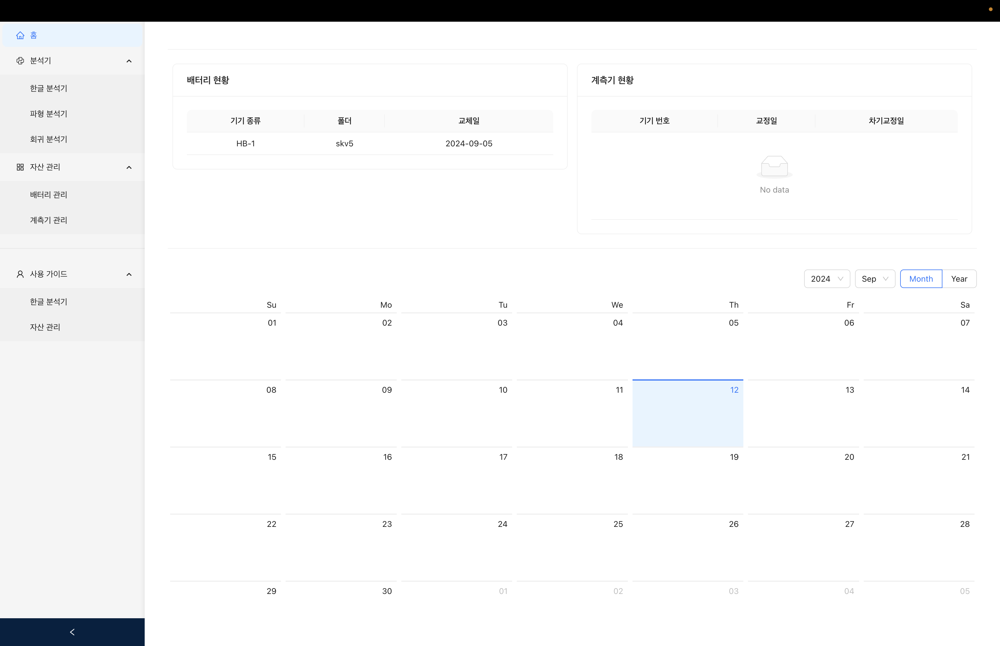
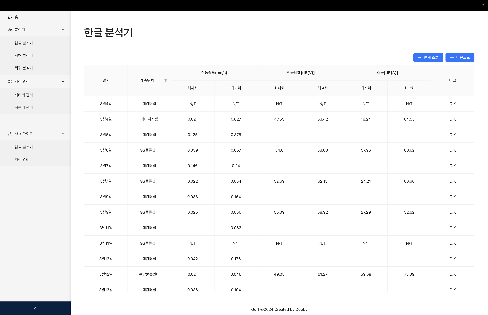
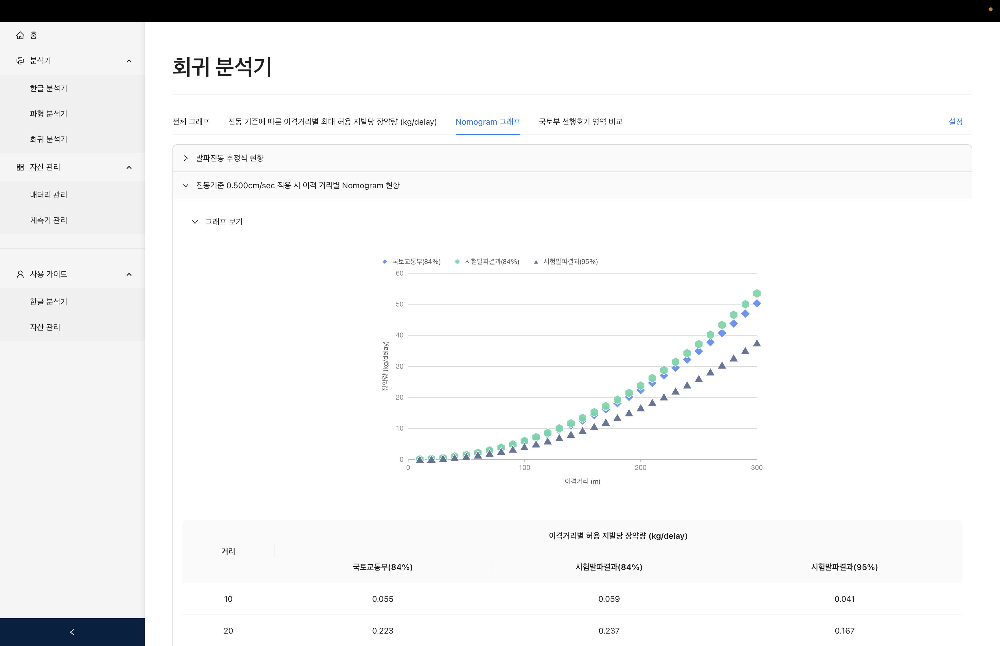
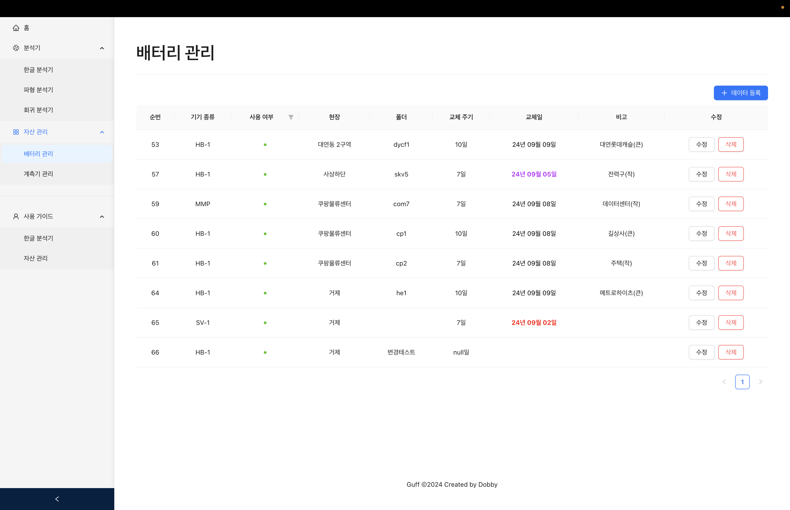

# **GUFF**

> **거명이엔씨의 데이터 분석 처리 및 배터리 현황을 확인할 수 있는 웹 서비스입니다.**

---

## **프로젝트 정보**

- **프로젝트 이름**: GUFF Project  
- **개발 기간**: `2024.05.02 ~ 2024.10.01`

---

## **팀 소개**

| **팀원** | 역할 |
| -------- | ---- |
|  | **서현우** [@Hyunwoo-Seo](https://github.com/Hyunwoo-Seo)  웹 디자인 및 코드 작성 |
|  | **강태화** [@Mandu](https://github.com/Kooo1225)  DB 작성, 백엔드 API 개발, 계산 함수 구현 |

---

## **주요 화면 구성**
### 1. **메인 화면**

> 메인화면에서 사용자는 각종 일정을 등록 및 관리할 수 있습니다.

---

### 2. **한글 분석기 화면**

> 사용자가 요청하는 버전과 문자열에 따른 분석 결과를 보여주는 페이지 입니다.

---

### 3. **파형 분석기 화면**

> 사용자가 요청하는 버전과 문자열에 따른 분석 결과를 보여주는 페이지 입니다.

---

### 4. **회귀 분석기 화면**

> 시험발파에서 진동계측을 위한 공법을 산정하기 위해서 사용하는 페이지 입니다.

---

### 5. **배터리 관리 화면**

> 현재 오피스에서 관리하고 있는 배터리의 현황을 관리할 수 있는 페이지 입니다.

---

### 6. **계측기 관리 화면**

> 현재 오피스에서 관리하고 있는 계측기의 현황을 관리할 수 있는 페이지 입니다.

---

## **기술 스택**

### **Front-end**

### **Back-end**

### **Design**

### **Cooperation**

---

## **개발 환경 설치/실행 방법**

### **Front-end**

### **Back-end**
